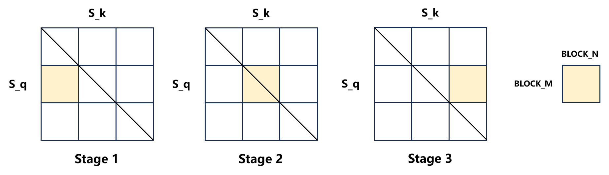
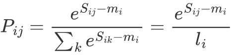
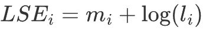

# Phase 3：从原型到可用 —— 工业级前向传播

目标：

* 将 Phase 2 的最小实现，逐步扩展为**工业级可用**的 FlashAttention 前向传播 
* 掌握真实场景中必须处理的几个关键工程问题：  
  * 从 2D 到 4D 的维度扩展和 program 映射
  * Causal Mask 在分块场景下的高效实现
  * 为反向传播保存必要的中间量
* 与 PyTorch 官方实现对比，验证功能正确性

说明：

* 本章每一节都是在上一节的基础上**叠加一个新特性**，每一节都会给出一个可跑、可验证的完整 kernel 

* 算法核心（**online softmax + 流式累加 output**）不会再变，本章关注的是**工程层面的扩展和打磨**

* 本章关注的是“**功能正确性**”，而非“极限性能”。所有关于**极致优化**的讨论，都将留到读者对 forward / backward 形成完整认识之后再展开。  


------

## 3.1 从 2D 到 4D —— program_id 的映射

回想一下 Phase 1 的 1.1 中提到的映射原则：

> 将 `(B, H)` 合并映射到 `tl.program_id(1)`，将 `(S, D)` 通过 block tiling 映射到 `tl.program_id(0)`。
>
> 让 `(B, H)` 作为"粗粒度并行"，`(S, D)` 作为"细粒度并行"。 

现在，又到它上场的时候了。

### 3.1.1 grid 的变化

Phase 2 的时候，最小实现只处理 2D 张量，`grid` 是一维的：

```python
# Q:[M, K_dim], 每个program 负责计算形状为 [BLOCK_M, K_dim] 的输出
grid = (triton.cdiv(M, BLOCK_M),) # 一维
pid_0 = tl.program_id(0) # 用于确定当前 program 处理哪一块 Q_block
```

到了真实场景，需要处理 **4D 张量** `[Batch, N_heads, Seq_len, Head_dim]`，grid 就变成二维的了：

```python
# Q: [Batch_size, N_heads, Seq_len, Head_dim], 每个program 依然负责计算形状为 [BLOCK_M, Head_dim] 的输出
grid = (triton.cdiv(Seq_len, BLOCK_M), Batch * N_heads) # 二维
#      \____________________________/  \_____________/
#              program_id(0)            program_id(1)
#             负责序列维度的分块         负责定位(batch, head)
```

注意 `(Batch, N_heads)` 是**合并**到 `program_id(1)` 的，不是分别占两个维度。

> 这就好比我们把所有的 batch 和 head 摊平排成一排（Y 轴），然后在每一行里，再把长长的序列切成小段（X 轴）。Triton 的调度器会并行地处理这二维网格上的每一个点。

### 3.1.2 重算指针偏移

grid 就变成二维后，指针偏移的计算方法也随之改变。以 Q 为例, 假设形状为 [Batch_size, N_heads, Seq_len, Head_dim]：

#### 步骤一：从 pid_1 反算 batch_idx 和 head_idx

batch_idx、head_idx 是当前 program 负责的那块 2D 张量所对应的 batch 和 head 索引

```python
pid_0 = tl.program_id(0) # 序列维度的分块位置（和 Phase 2 一样）
pid_1 = tl.program_id(1) # (batch, head) 的组合编号
batch_idx = pid_1 // N_heads
head_idx = pid_1 % N_heads
```

#### 步骤二：算指针偏移

先根据 batch_idx、head_idx 和对应的 stride 计算当前 (batch, head) 的起点，再**加上**当前 program 负责的那块 2D 张量在序列维度和 `head_dim` 维度的偏移即可。

> 注意：进入工程可用阶段后，输入是 4D 张量，为了更**贴合语义**，我们将输入矩阵在 4 个维度的 stride 命名为：`stride_qb`、`stride_qh`、`stride_qs`、`stride_qd` （以 Q 为例）。
>
> 同时，序列维度的命名也要修改：在 Phase 1、2 中我们将序列维度称为 `M` 和 `N`，是为了区分 Q 和 K/V。但在 Phase 3 及以后，我们统一使用更通用的术语 `S_q` (Sequence length of Q) 和 `S_k` (Sequence length of K)。而 Head Dimension 统一称为 `D`。

```python
# 块内偏移（和 Phase 2 的逻辑一样）
Sq_offs = pid_0 * BLOCK_M + tl.arange(0, BLOCK_M)  # Q 矩阵的序列维度偏移, [BLOCK_M,]
d_offs = tl.arange(0, Head_dim)                    # head_dim 维度偏移, [Head_dim,]

q_ptrs = (
	Q_ptr # Q 矩阵的指针
    + batch_idx * stride_qb 
    + head_idx * stride_qh 
    + Sq_offs[:, None] * stride_qs 
    + d_offs[None, :] * stride_qd
) # [BLOCK_M, Head_dim]
```

FlashAttention 的**并行粒度从未改变**：**一个 program 负责一个 `Q_block`**。Phase 3 只是把“这个 program 属于哪个 (batch, head)”这件事补齐了。

### 3.1.3 完整实现和正确性检验

输入矩阵的维度从 2D 扩展到 4D，online softmax 的循环逻辑**完全不变**， 唯二变化在于：grid从一维变成二维，以及每个 program 定位自己负责的那块数据的方式。

> **再次提醒**：进入工程可用阶段后，输入是 4D 张量，为了更**贴合语义**，我将 kernel 的参数名与部分变量名做了一些修改，建议大家阅读这部分的时候**慢一点，先熟悉新的命名体系**。


```python
# 4D 场景下的完整实现
import torch
import torch.nn.functional as F
from torch.nn.attention import SDPBackend, sdpa_kernel
import triton
import triton.language as tl

@triton.jit
def flash_attention_forward_kernel(
    # -------------------- 指针 --------------------
    Q_ptr, K_ptr, V_ptr, O_ptr, # 输入输出矩阵指针

    # ---------------- stride(有修改) ---------------
    stride_qb, stride_qh, stride_qs, stride_qd,  # Q 在四个维度上的 stride
    stride_kb, stride_kh, stride_ks, stride_kd,  # K 在四个维度上的 stride
    stride_vb, stride_vh, stride_vs, stride_vd,  # V 在四个维度上的 stride
    stride_ob, stride_oh, stride_os, stride_od,  # O 在四个维度上的 stride

    # -------------------- 缩放因子 --------------------
    scale, # 1 / sqrt(D)
    
    # ---------------- 维度信息(有修改) ---------------
    # Q: [B, H, S_q, D],  K/V: [B, H, S_k, D],  O: [B, H, S_q, D]
    B: tl.constexpr,       # batch size
    H: tl.constexpr,       # 注意力头数
    S_q: tl.constexpr,     # 序列长度 (Q 和 O 的行数)
    S_k: tl.constexpr,     # 序列长度 (K/V 的行数)
    D: tl.constexpr,       # head_dim

    # -------------------- 配置参数 ---------------------
    BLOCK_M: tl.constexpr, # Q_block 的行数
    BLOCK_N: tl.constexpr, # 流式扫描 K/V 的列块大小 (沿 N 维)
):
    """
    FlashAttention forward 4D
    """
    pid_0 = tl.program_id(0) 
    pid_1 = tl.program_id(1)
    batch_idx = pid_1 // H
    head_idx = pid_1 % H

    Sq_offs = pid_0 * BLOCK_M + tl.arange(0, BLOCK_M)  # [BLOCK_M,]
    d_offs = tl.arange(0, D)                           # [D,]

    # mask：处理最后一个 Q_block, 因为可能越界
    mask_Sq = Sq_offs < S_q
    
    # load Q block, q_ptrs 计算方式有修改
    q_ptrs = (
        Q_ptr
        + batch_idx * stride_qb 
        + head_idx * stride_qh 
        + Sq_offs[:, None] * stride_qs 
        + d_offs[None, :] * stride_qd
    ) # [BLOCK_M, D]
    q_block = tl.load(q_ptrs, mask=mask_Sq[:, None], other=0.0)

    # 初始化统计量
    m = tl.full([BLOCK_M], float('-inf'), tl.float32)
    l = tl.zeros([BLOCK_M], tl.float32)
    o = tl.zeros([BLOCK_M, D], tl.float32)

    LOG2_E = 1.44269504 # log2(e), 用于tl.exp 到 tl.exp2 的转化

    # 逐块处理 K/V block
    for start_s in range(0, S_k, BLOCK_N):
        # load K/V block, 指针计算方式有修改
        Sk_offs = start_s + tl.arange(0, BLOCK_N)
        k_ptrs = (
            K_ptr
            + batch_idx * stride_kb 
            + head_idx * stride_kh 
            + Sk_offs[:, None] * stride_ks 
            + d_offs[None, :] * stride_kd
        )
        v_ptrs = (
            V_ptr
            + batch_idx * stride_vb 
            + head_idx * stride_vh 
            + Sk_offs[:, None] * stride_vs 
            + d_offs[None, :] * stride_vd
        )
        mask_Sk = Sk_offs < S_k
        k_block = tl.load(k_ptrs, mask=mask_Sk[:, None], other=0.0) # [BLOCK_N, D]
        v_block = tl.load(v_ptrs, mask=mask_Sk[:, None], other=0.0) # [BLOCK_N, D]

        # 计算 score, [BLOCK_M, D] @ [D, BLOCK_N] -> [BLOCK_M, BLOCK_N]
        s = tl.dot(q_block, tl.trans(k_block)) * scale  # [BLOCK_M, BLOCK_N]
        s = tl.where(mask_Sk[None, :], s, float('-inf')) # [BLOCK_M, BLOCK_N]

        # 更新统计量
        m_new = tl.maximum(m, tl.max(s, axis=1)) # [BLOCK_M,]

        correction = tl.exp2((m - m_new) * LOG2_E) # [BLOCK_M,]
        numerator = tl.exp2((s - m_new[:, None]) * LOG2_E) # [BLOCK_M, BLOCK_N]

        l = l * correction + tl.sum(numerator, axis=1) # [BLOCK_M,]
        # Tensor Core 的矩阵乘法要求输入为半精度(或 TF32)
        # 因此这里将 numerator 转回 fp16, 使 tl.dot 有机会使用 Tensor Core
        # 而累加仍然在 fp32 的 o 中完成, 以保证数值稳定性
        o = o * correction[:, None] + tl.dot(numerator.to(tl.float16), v_block) # [BLOCK_M, D]

        m = m_new
    
    # 最终归一化
    o_final = o / l[:, None]

    # write back to O_ptr
    o_ptrs = (
        O_ptr
        + batch_idx * stride_ob 
        + head_idx * stride_oh 
        + Sq_offs[:, None] * stride_os 
        + d_offs[None, :] * stride_od
    )
    tl.store(o_ptrs, o_final, mask=mask_Sq[:, None])

# 调用函数
def launch_kernel(B, H, S_q, S_k, D, BLOCK_M, BLOCK_N, device):
    
    Q = torch.randn((B, H, S_q, D), dtype=torch.float16, device=device)
    K = torch.randn((B, H, S_k, D), dtype=torch.float16, device=device)
    V = torch.randn((B, H, S_k, D), dtype=torch.float16, device=device)
    O = torch.empty((B, H, S_q, D), dtype=torch.float16, device=device)

    grid = (triton.cdiv(S_q, BLOCK_M), B * H) # 二维
    flash_attention_forward_kernel[grid](
        Q, K, V, O,
        Q.stride(0), Q.stride(1), Q.stride(2), Q.stride(3),
        K.stride(0), K.stride(1), K.stride(2), K.stride(3),
        V.stride(0), V.stride(1), V.stride(2), V.stride(3),
        O.stride(0), O.stride(1), O.stride(2), O.stride(3),
        scale=1 / (D ** 0.5),
        B=B, H=H, S_q=S_q, S_k=S_k, D=D,
        BLOCK_M=BLOCK_M, BLOCK_N=BLOCK_N,        
        num_warps=4, 
        num_stages=3,
    )
	
    # 使用 pytorch 官方实现作为基准
    with sdpa_kernel(SDPBackend.MATH): # 显式启用 math 后端
        bench = F.scaled_dot_product_attention(
            Q.to(torch.float32), 
            K.to(torch.float32), 
            V.to(torch.float32),
            attn_mask=None,
            dropout_p=0.0,
            is_causal=False,
        ).to(torch.float16)

    return O, bench
```

为了验证 kernel 的功能正确性，我们使用 PyTorch 官方提供的 `scaled_dot_product_attention` 作为参考实现。需要注意的是，该接口会在多个后端之间自动选择。在这里，我们**显式启用 math 后端**，将其作为**稳定、可复现的参考基准**。校验函数则使用 Phase 2 的 2.2.3 所展示的 `verify_results`。

* 当 B = 32，H = 8，S_q = 128，S_k = 128，D = 128，BLOCK_M = 64，BLOCK_N = 64：测试通过
* 当 B = 32，H = 8，S_q = 500，S_k = 500，D = 128，BLOCK_M = 64，BLOCK_N = 64：测试通过
* ……

* 当 B = 32，H = 8，S_q = 1024，S_k = 4096，D = 128，BLOCK_M = 64，BLOCK_N = 64：测试通过（这意味着当前 kernel 已经自然支持 cross-attention（`S_q ≠ S_k`）的前向传播）

到目前为止，我们实现的是 **non-causal** 的 forward。下一节我们将引入 causal mask，并讨论分块扫描 K/V 时，如何正确实现“下三角遮挡”。

------

## 3.2 Causal Mask —— 分块场景下的三角遮挡

简单回顾一下 Causal Mask：

在 GPT 等模型的 Masked Self-Attention 层中，需要使用 causal mask 保证 Token $i$ 只能看到 Token $j$ ($j \le i$)。在标准 Attention 中，需要构造一个巨大的 $S\times S$ 的下三角矩阵（$S$ 为序列长度），但在 FlashAttention 中，我们没有这个矩阵，而是随着逐块处理 K/V，动态生成。由于是动态生成，我们可以使用一些手段，减少无效计算和无效循环，核心思想是：“**能省就省，该算才算**”。

这里我们主要用到两种优化手段：

* **Block 级剪枝（Pruning）**：注定看不到的 Block，直接不加载（物理省流）
* **条件掩码（Conditional Masking）**：注定全能看到的 Block，跳过掩码计算（逻辑省算力）。

### 3.2.1 Causal Mask 三大阶段图解

FlashAttention 逐块处理 K 矩阵时，causal mask 存在三大阶段，如下图所示：



* Stage 1：当前 block 完全位于主对角线左侧，都会被看见，因此正常计算 Attention，但**跳过 causal mask 生成和 `tl.where` 操作**
* Stage 2：block 内部分元素位于主对角线右侧，需要屏蔽，因此正常计算，并执行 **Element-wise Masking**
* Stage 3：block 的所有元素都位于主对角线右侧，无需计算，直接**截断循环**，连加载都省掉

### 3.2.2 代码实现

#### 步骤一：增加 is_causal 参数

在 kernel 函数入参中增加 `is_causal`，用于设置是否使用 causal mask。

#### 步骤二：调整循环范围

当前 block 在 S_q 维度的最大索引为 `(pid_0 + 1) * BLOCK_M - 1`，那么在 S_k 维度，最多能看到 `(pid_0 + 1) * BLOCK_M - 1` 处的元素，在此之外的元素注定看不到，就没必要纳入循环之中，从而节省循环指令开销。代码实现也很简单：

```python
# 原本的逐块处理 K/V block
for start_s in range(0, S_k, BLOCK_N):
# 修改为：
loop_end = (pid_0 + 1) * BLOCK_M if is_causal else S_k # causal 模式可以提前截断循环
for start_s in range(0, loop_end, BLOCK_N):
```

这样就成功处理了 Stage 3 这一阶段。

#### 步骤三：增加条件掩码

调整循环范围后，我们还需要处理 Stage 1 和 2 两种情况。当 block 对应的所有 S_q 维度索引都大于 S_k 维度索引时，不需要处理 causal mask，反之，才必须计算。即：

```python
# 当前 block 全部能被看见的判定条件：Q block的最小索引 >= K block的最大索引
# 需要 causal mask 的判定条件：
q_idx_min = pid_0 * BLOCK_M
k_idx_max = start_s + BLOCK_N - 1
if is_causal and not (q_idx_min >= k_idx_max):
    causal_mask = Sq_offs[:, None] >= Sk_offs[None, :] # [BLOCK_M, BLOCK_N]
    s = tl.where(causal_mask, s, float('-inf')) # [BLOCK_M, BLOCK_N]
```

### 3.2.3 完整实现与正确性检验

```python
@triton.jit
def flash_attention_forward_kernel(
    # -------------------- 指针 --------------------
    Q_ptr, K_ptr, V_ptr, O_ptr, # 输入输出矩阵指针

    # -------------------- stride --------------------
    stride_qb, stride_qh, stride_qs, stride_qd,  # Q 在四个维度上的 stride
    stride_kb, stride_kh, stride_ks, stride_kd,  # K 在四个维度上的 stride
    stride_vb, stride_vh, stride_vs, stride_vd,  # V 在四个维度上的 stride
    stride_ob, stride_oh, stride_os, stride_od,  # O 在四个维度上的 stride

    # -------------------- 缩放因子 --------------------
    scale, # 1 / sqrt(D)
    
    # -------------------- 维度信息 --------------------
    # Q: [B, H, S_q, D],  K/V: [B, H, S_k, D],  O: [B, H, S_q, D]
    B: tl.constexpr,       # batch size
    H: tl.constexpr,       # 注意力头数
    S_q: tl.constexpr,     # 序列长度 (Q 和 O 的行数)
    S_k: tl.constexpr,     # 序列长度 (K/V 的行数)
    D: tl.constexpr,       # head_dim

    # -------------------- 配置参数 ---------------------
    BLOCK_M: tl.constexpr, # Q_block 的行数
    BLOCK_N: tl.constexpr, # 流式扫描 K/V 的列块大小 (沿 N 维)
    
    # ==========================================================
    # 优化1：增加 Flag 参数
    # ==========================================================
    is_causal: tl.constexpr = False,
):
    """
    FlashAttention forward with causal mask
    """
    pid_0 = tl.program_id(0) 
    pid_1 = tl.program_id(1)
    batch_idx = pid_1 // H
    head_idx = pid_1 % H

    Sq_offs = pid_0 * BLOCK_M + tl.arange(0, BLOCK_M)  # [BLOCK_M,]
    d_offs = tl.arange(0, D)                           # [D,]

    # mask：处理最后一个 Q_block, 因为可能越界
    mask_Sq = Sq_offs < S_q
    
    # load Q block
    q_ptrs = (
        Q_ptr
        + batch_idx * stride_qb 
        + head_idx * stride_qh 
        + Sq_offs[:, None] * stride_qs 
        + d_offs[None, :] * stride_qd
    ) # [BLOCK_M, D]
    q_block = tl.load(q_ptrs, mask=mask_Sq[:, None], other=0.0)

    # 初始化统计量
    m = tl.full([BLOCK_M], float('-inf'), tl.float32)
    l = tl.zeros([BLOCK_M], tl.float32)
    o = tl.zeros([BLOCK_M, D], tl.float32)

    LOG2_E = 1.44269504 # log2(e), 用于tl.exp 到 tl.exp2 的转化

    # 逐块处理 K/V block
    # ==========================================================
    # 优化2：Loop 剪枝
    # ==========================================================
    loop_end = (pid_0 + 1) * BLOCK_M if is_causal else S_k # causal 模式可以提前截断循环
    for start_s in range(0, loop_end, BLOCK_N):
        # load K/V block
        Sk_offs = start_s + tl.arange(0, BLOCK_N)
        k_ptrs = (
            K_ptr
            + batch_idx * stride_kb 
            + head_idx * stride_kh 
            + Sk_offs[:, None] * stride_ks 
            + d_offs[None, :] * stride_kd
        )
        v_ptrs = (
            V_ptr
            + batch_idx * stride_vb 
            + head_idx * stride_vh 
            + Sk_offs[:, None] * stride_vs 
            + d_offs[None, :] * stride_vd
        )
        mask_Sk = Sk_offs < S_k
        k_block = tl.load(k_ptrs, mask=mask_Sk[:, None], other=0.0) # [BLOCK_N, D]
        v_block = tl.load(v_ptrs, mask=mask_Sk[:, None], other=0.0) # [BLOCK_N, D]

        # 计算 score, [BLOCK_M, D] @ [D, BLOCK_N] -> [BLOCK_M, BLOCK_N]
        s = tl.dot(q_block, tl.trans(k_block)) * scale  # [BLOCK_M, BLOCK_N]
        s = tl.where(mask_Sk[None, :], s, float('-inf')) # [BLOCK_M, BLOCK_N]

        # ==========================================================
        # 优化3：条件掩码
        # ==========================================================
        # 当前 block 全部能被看见的判定条件：Q block的最小索引 >= K block的最大索引
        # 需要 causal mask 的判定条件：
        if is_causal:
            q_idx_min = pid_0 * BLOCK_M
            k_idx_max = start_s + BLOCK_N - 1
            if not (q_idx_min >= k_idx_max):
                causal_mask = Sq_offs[:, None] >= Sk_offs[None, :] # [BLOCK_M, BLOCK_N]
                s = tl.where(causal_mask, s, float('-inf')) # [BLOCK_M, BLOCK_N]

        # 更新统计量
        m_new = tl.maximum(m, tl.max(s, axis=1)) # [BLOCK_M,]

        correction = tl.exp2((m - m_new) * LOG2_E) # [BLOCK_M,]
        numerator = tl.exp2((s - m_new[:, None]) * LOG2_E) # [BLOCK_M, BLOCK_N]

        l = l * correction + tl.sum(numerator, axis=1) # [BLOCK_M,]
        # Tensor Core 的矩阵乘法要求输入为半精度(或 TF32)
        # 因此这里将 numerator 转回 fp16, 使 tl.dot 有机会使用 Tensor Core
        # 而累加仍然在 fp32 的 o 中完成, 以保证数值稳定性
        o = o * correction[:, None] + tl.dot(numerator.to(tl.float16), v_block) # [BLOCK_M, D]

        m = m_new
    
    # 最终归一化
    o_final = o / l[:, None]

    # write back to O_ptr
    o_ptrs = (
        O_ptr
        + batch_idx * stride_ob 
        + head_idx * stride_oh 
        + Sq_offs[:, None] * stride_os 
        + d_offs[None, :] * stride_od
    )
    tl.store(o_ptrs, o_final, mask=mask_Sq[:, None])

def launch_kernel(B, H, S_q, S_k, D, BLOCK_M, BLOCK_N, device):
    
    Q = torch.randn((B, H, S_q, D), dtype=torch.float16, device=device)
    K = torch.randn((B, H, S_k, D), dtype=torch.float16, device=device)
    V = torch.randn((B, H, S_k, D), dtype=torch.float16, device=device)
    O = torch.empty((B, H, S_q, D), dtype=torch.float16, device=device)

    grid = (triton.cdiv(S_q, BLOCK_M), B * H)
    flash_attention_forward_kernel[grid](
        Q, K, V, O,
        Q.stride(0), Q.stride(1), Q.stride(2), Q.stride(3),
        K.stride(0), K.stride(1), K.stride(2), K.stride(3),
        V.stride(0), V.stride(1), V.stride(2), V.stride(3),
        O.stride(0), O.stride(1), O.stride(2), O.stride(3),
        scale=1 / (D ** 0.5),
        B=B, H=H, S_q=S_q, S_k=S_k, D=D,
        BLOCK_M=BLOCK_M, BLOCK_N=BLOCK_N,        
        is_causal=True,
        num_warps=4,
        num_stages=3,
    )

    with sdpa_kernel(SDPBackend.MATH): # 显式启用 math 后端
        bench = F.scaled_dot_product_attention(
            Q.to(torch.float32), 
            K.to(torch.float32), 
            V.to(torch.float32),
            attn_mask=None,
            dropout_p=0.0,
            is_causal=True,
        ).to(torch.float16)

    return O, bench
```

使用 `F.scaled_dot_product_attention(..., is_causal=True,)` 并显式启用 math 后端作为基准，校验函数继续使用 Phase 2 的 2.2.3 所展示的 `verify_results`。检验结果如下：

* 当 B = 32，H = 8，S_q = 128，S_k = 128，D = 128，BLOCK_M = 64，BLOCK_N = 64：测试通过
* 当 B = 32，H = 8，S_q = 500，S_k = 500，D = 128，BLOCK_M = 64，BLOCK_N = 64：测试通过
* ……
* 当 B = 32，H = 8，S_q = 1024，S_k = 1024，D = 128，BLOCK_M = 64，BLOCK_N = 64：测试通过

恭喜你，成功实现了 FlashAttention 的 causal mask 功能，在从原型到工业可用的道路上又前进了一大步！

------

## 3.3 保存 LSE —— 为 Backward 做好准备

目标：

* 理解 FlashAttention 反向传播（Backward）的核心依赖：**重计算（Recomputation）**
* 理解为何只需要保存**行统计量**就能还原 Softmax 矩阵
* 实现 `LSE (Log-Sum-Exp)` 的计算与存储，完成前向传播 kernel 的最终形态

说明：

- 这是 Forward Kernel 的最后一步。加上这一步，我们的 Kernel 就真正具备了被 PyTorch `autograd` 调用的资格。
- 我们将引入一个工业界的标准优化：**只存 `m + log(l)`，而不是分别存 `m` 和 `l`**。

### 3.3.1 为什么需要保存统计量？

在 Phase 1 中我们提到，FlashAttention 的核心优势在于不存储巨大的 $N^2$ 级的注意力矩阵 $P$。但在反向传播时，为了计算梯度 $dQ$、$dK$、$dV$，我们需要用到 $P$。FlashAttention 的策略是：**用时间换空间，在 Backward 的时候重新计算一次 $P$。**

但是，重新计算 $P$ 并不是简单地重做一遍 $Q \cdot K^T$，回想一下 Softmax 公式：



由于我们保存了 $Q$、$K$，所以在 Backward 时可以重算 $S_{ij}$。但如果我们没有保存前向传播时最终的 $m_i$（最大值）和 $l_i$（归一化分母），我们就无法还原出正确的概率值 $P_{ij}$。因此，我们需要把这两个“种子”信息保存下来。好消息是，它们的形状是 `[Batch, Head, Seq_len]`，相比于 $O(N^2)$ 的 $P$ 矩阵，这只是 $O(N)$ 的开销，可以忽略不计。

### 3.3.2 合并存储统计量 (LogSumExp)

我们通常不分别存 $m$ 和 $l$，而是存一个合并的值 $LSE$ ：



主要原因有两点：

* 省内存：少存一个张量，存储统计量的显存占用减半
* 数学便利：在反向传播的梯度推导中，$\log(P)$ 经常出现，而 $\log(P_{ij}) = S_{ij} - LSE_i$。直接存 $LSE$ 会让反向传播的代码更简洁。

### 3.3.3 指针计算

需要新增一个输出张量 `L`（用于存储 $LSE$），形状为 `[B, H, S_q]`，$l_i$ 是 per-row 的，所以没有 D 维度。每个 Program 处理 `BLOCK_M` 行输出，因此也负责生成 `BLOCK_M` 个 LSE 值。指针计算方式如下：

```python
# 假设 L 的 stride 为 stride_lb, stride_lh, stride_ls
# 由于 L 是 3D 张量，指针计算公式比 Q、K、V、O 少一项：
l_ptrs = (
    L_ptr 
    + batch_idx * stride_lb
    + head_idx * stride_lh 
    + Sq_offs * stride_ls
)
```

### 3.3.4 完整实现与正确性校验

```python
@triton.jit
def flash_attention_forward_kernel(
    # -------------------- 指针 --------------------
    Q_ptr, K_ptr, V_ptr, O_ptr, # 输入输出矩阵指针
    # ==========================================================
    # 优化1：增加统计量输出指针 + stride
    # ==========================================================
    L_ptr,                      # 新增统计量输出指针

    # -------------------- stride --------------------
    stride_qb, stride_qh, stride_qs, stride_qd,  # Q 在四个维度上的 stride
    stride_kb, stride_kh, stride_ks, stride_kd,  # K 在四个维度上的 stride
    stride_vb, stride_vh, stride_vs, stride_vd,  # V 在四个维度上的 stride
    stride_ob, stride_oh, stride_os, stride_od,  # O 在四个维度上的 stride
    stride_lb, stride_lh, stride_ls,             # L 在三个维度上的 stride (新增)

    # -------------------- 缩放因子 --------------------
    scale, # 1 / sqrt(D)

    # -------------------- 维度信息 --------------------
    # Q: [B, H, S_q, D],  K/V: [B, H, S_k, D],  O: [B, H, S_q, D]
    B: tl.constexpr,       # batch size
    H: tl.constexpr,       # 注意力头数
    S_q: tl.constexpr,     # 序列长度 (Q 和 O 的行数)
    S_k: tl.constexpr,     # 序列长度 (K/V 的行数)
    D: tl.constexpr,       # head_dim

    # -------------------- 配置参数 ---------------------
    BLOCK_M: tl.constexpr, # Q_block 的行数
    BLOCK_N: tl.constexpr, # 流式扫描 K/V 的列块大小 (沿 N 维)
    
    # -------------------- Flag参数 --------------------
    is_causal: tl.constexpr = False,
):
    """
    FlashAttention forward with LogSumExp write back
    """
    pid_0 = tl.program_id(0) 
    pid_1 = tl.program_id(1)
    batch_idx = pid_1 // H
    head_idx = pid_1 % H

    Sq_offs = pid_0 * BLOCK_M + tl.arange(0, BLOCK_M)  # [BLOCK_M,]
    d_offs = tl.arange(0, D)                           # [D,]

    # mask：处理最后一个 Q_block, 因为可能越界
    mask_Sq = Sq_offs < S_q
    
    # load Q block
    q_ptrs = (
        Q_ptr
        + batch_idx * stride_qb 
        + head_idx * stride_qh 
        + Sq_offs[:, None] * stride_qs 
        + d_offs[None, :] * stride_qd
    ) # [BLOCK_M, D]
    q_block = tl.load(q_ptrs, mask=mask_Sq[:, None], other=0.0)

    # 初始化统计量
    m = tl.full([BLOCK_M], float('-inf'), tl.float32)
    l = tl.zeros([BLOCK_M], tl.float32)
    o = tl.zeros([BLOCK_M, D], tl.float32)

    LOG2_E = 1.44269504 # log2(e), 用于tl.exp 到 tl.exp2 的转化

    # 逐块处理 K/V block
    loop_end = (pid_0 + 1) * BLOCK_M if is_causal else S_k # causal 模式可以提前截断循环
    for start_s in range(0, loop_end, BLOCK_N):
        # load K/V block
        Sk_offs = start_s + tl.arange(0, BLOCK_N)
        k_ptrs = (
            K_ptr
            + batch_idx * stride_kb 
            + head_idx * stride_kh 
            + Sk_offs[:, None] * stride_ks 
            + d_offs[None, :] * stride_kd
        )
        v_ptrs = (
            V_ptr
            + batch_idx * stride_vb 
            + head_idx * stride_vh 
            + Sk_offs[:, None] * stride_vs 
            + d_offs[None, :] * stride_vd
        )
        mask_Sk = Sk_offs < S_k
        k_block = tl.load(k_ptrs, mask=mask_Sk[:, None], other=0.0) # [BLOCK_N, D]
        v_block = tl.load(v_ptrs, mask=mask_Sk[:, None], other=0.0) # [BLOCK_N, D]

        # 计算 score, [BLOCK_M, D] @ [D, BLOCK_N] -> [BLOCK_M, BLOCK_N]
        s = tl.dot(q_block, tl.trans(k_block)) * scale  # [BLOCK_M, BLOCK_N]
        s = tl.where(mask_Sk[None, :], s, float('-inf')) # [BLOCK_M, BLOCK_N]

        # 当前 block 全部能被看见的判定条件：Q block的最小索引 >= K block的最大索引
        # 需要 causal mask 的判定条件：
        if is_causal:
            q_idx_min = pid_0 * BLOCK_M
            k_idx_max = start_s + BLOCK_N - 1
            if not (q_idx_min >= k_idx_max):
                causal_mask = Sq_offs[:, None] >= Sk_offs[None, :] # [BLOCK_M, BLOCK_N]
                s = tl.where(causal_mask, s, float('-inf')) # [BLOCK_M, BLOCK_N]

        # 更新统计量
        m_new = tl.maximum(m, tl.max(s, axis=1)) # [BLOCK_M,]

        correction = tl.exp2((m - m_new) * LOG2_E) # [BLOCK_M,]
        numerator = tl.exp2((s - m_new[:, None]) * LOG2_E) # [BLOCK_M, BLOCK_N]

        l = l * correction + tl.sum(numerator, axis=1) # [BLOCK_M,]
        # Tensor Core 的矩阵乘法要求输入为半精度(或 TF32)
        # 因此这里将 numerator 转回 fp16, 使 tl.dot 有机会使用 Tensor Core
        # 而累加仍然在 fp32 的 o 中完成, 以保证数值稳定性
        o = o * correction[:, None] + tl.dot(numerator.to(tl.float16), v_block) # [BLOCK_M, D]

        m = m_new
    
    # 最终归一化
    o_final = o / l[:, None] 

    # write back to O_ptr
    o_ptrs = (
        O_ptr
        + batch_idx * stride_ob 
        + head_idx * stride_oh 
        + Sq_offs[:, None] * stride_os 
        + d_offs[None, :] * stride_od
    )
    tl.store(o_ptrs, o_final, mask=mask_Sq[:, None])

    # ==========================================================
    # 优化2：保存 LogSumExp
    # ==========================================================
    # 计算 LogSumExp
    lse = m + tl.log(l) # [BLOCK_M,]
    
    # write back to L_ptr
    l_ptrs = (
        L_ptr 
        + batch_idx * stride_lb
        + head_idx * stride_lh 
        + Sq_offs * stride_ls
    )
    tl.store(l_ptrs, lse, mask=mask_Sq)

def LSE_bench(Q, K, scale, is_causal):
    # Q: [B,H,S_q,D], K: [B,H,S_k,D]
    S = torch.matmul(Q, K.transpose(-2, -1)) * scale  # [B,H,Sq,Sk]
    if is_causal:
        S_q = S.size(-2); S_k = S.size(-1)
        i = torch.arange(S_q, device=S.device)[:, None]
        j = torch.arange(S_k, device=S.device)[None, :]
        causal_mask = j <= i
        S = S.masked_fill(~causal_mask, float('-inf'))
    return torch.logsumexp(S, dim=-1)  # [B,H,S_q]

def launch_kernel(B, H, S_q, S_k, D, BLOCK_M, BLOCK_N, device):
    
    Q = torch.randn((B, H, S_q, D), dtype=torch.float16, device=device)
    K = torch.randn((B, H, S_k, D), dtype=torch.float16, device=device)
    V = torch.randn((B, H, S_k, D), dtype=torch.float16, device=device)
    O = torch.empty((B, H, S_q, D), dtype=torch.float16, device=device)
    L = torch.empty((B, H, S_q), dtype=torch.float32, device=device) # 新增

    grid = (triton.cdiv(S_q, BLOCK_M), B * H)
    flash_attention_forward_kernel[grid](
        Q, K, V, O,
        L, # 新增
        Q.stride(0), Q.stride(1), Q.stride(2), Q.stride(3),
        K.stride(0), K.stride(1), K.stride(2), K.stride(3),
        V.stride(0), V.stride(1), V.stride(2), V.stride(3),
        O.stride(0), O.stride(1), O.stride(2), O.stride(3),
        L.stride(0), L.stride(1), L.stride(2), # 新增
        scale=1 / (D ** 0.5),
        B=B, H=H, S_q=S_q, S_k=S_k, D=D, 
        BLOCK_M=BLOCK_M, BLOCK_N=BLOCK_N,        
        is_causal=True,
        num_warps=4,  
        num_stages=3,
    )

    with sdpa_kernel(SDPBackend.MATH): # 显式启用 math 后端
        bench = F.scaled_dot_product_attention(
            Q.to(torch.float32), 
            K.to(torch.float32), 
            V.to(torch.float32),
            attn_mask=None,
            dropout_p=0.0,
            is_causal=True,
        ).to(torch.float16)

    # LSE 基准
    lse_bench = LSE_bench(
        Q.to(torch.float32), 
        K.to(torch.float32), 
        scale = 1 / (D ** 0.5), 
        is_causal = True
    )
    max_abs = (L - lse_bench).abs().max()
    LSE_test = max_abs < 1e-3

    return O, bench, LSE_test
```

这里，我们不仅要校验 `O` 的正确性，也要看一下 `L` 是否被正确写入。使用 `LSE_bench` 函数计算 `L` 的基准。测试结果如下：

* 当 B = 32，H = 8，S_q = 128，S_k = 128，D = 128，BLOCK_M = 64，BLOCK_N = 64：测试通过

* 当 B = 32，H = 8，S_q = 500，S_k = 500，D = 128，BLOCK_M = 64，BLOCK_N = 64：测试通过

* ……
* 当 B = 32，H = 8，S_q = 1024，S_k = 1024，D = 128，BLOCK_M = 64，BLOCK_N = 64：测试通过


------

## 3.4 小结

恭喜！通过 Phase 3 的学习，你已经把那个简陋的“最小实现”打造成了一个**功能完备、具备工业级特性的 FlashAttention 前向算子**。

让我们回顾一下这个 Kernel 的进化之路：

1. **Phase 2**：实现 `online softmax`，破开了物理与逻辑之墙
2. **Phase 3.1**：扩展到 4D 张量，利用 `grid` 处理 Batch 和 Head
3. **Phase 3.2**：引入 Causal Mask，并利用 Block 级剪枝和条件掩码优化性能，尽可能降低无效计算
4. **Phase 3.3**：实现了 LSE 的存储，为反向传播埋下了伏笔

现在的 `flash_attention_forward_kernel`，已经具备了去挑战 PyTorch 原生性能的资格，尽管只能比较前向传播的性能。你是不是已经迫不及待想要看它跑得有多快了。当然可以！去试试吧。

然后你会发现性能远没有达到你心中的要求，因为到目前为止，我们主要的目光还是集中在功能正确性上，并没有进行极致优化。那我们会不会讲如何优化呢？当然会啦，不过在此之前，我们要先进入 backward 的学习。因为只有对 FlashAttention 的算法全貌有所掌握，才能真正理解那些优化手段。

准备好了吗？让我们向 **Phase 4: Backward** 进发！

> 关于功能边界的说明：
>
> 本章完成的 FlashAttention 前向传播 kernel，在算法结构和计算语义上已经是**完整的**：它支持多 batch、多 head、causal/non-causal attention，并正确实现了 online softmax 与必要的统计量保存。在实际框架中，FlashAttention 还常常包含诸如 **dropout** 和 **变长序列（padding / cu_seqlens）** 等功能。但需要强调的是，这两者并不改变 FlashAttention 的核心算法结构，而主要属于 **训练阶段的随机性注入** 与 **接口层面的工程适配**。
>
> 为了保持主线清晰、避免读者在尚未理解 backward 之前引入过多工程细节，本章有意不实现这两项功能。相关思路将在最后一章进行讲解，并作为拓展练习留给读者自行完成。
