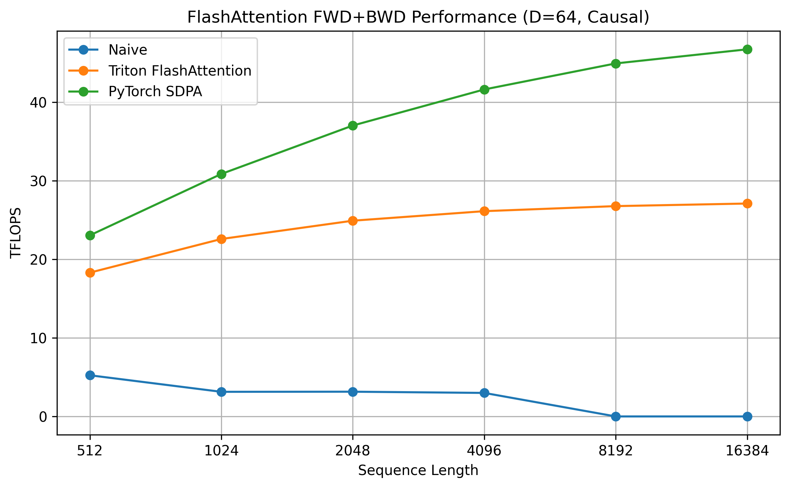
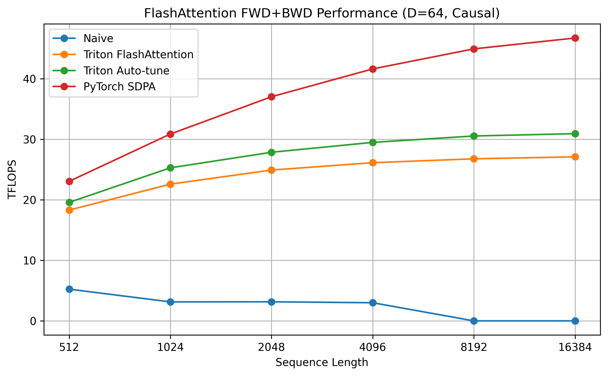
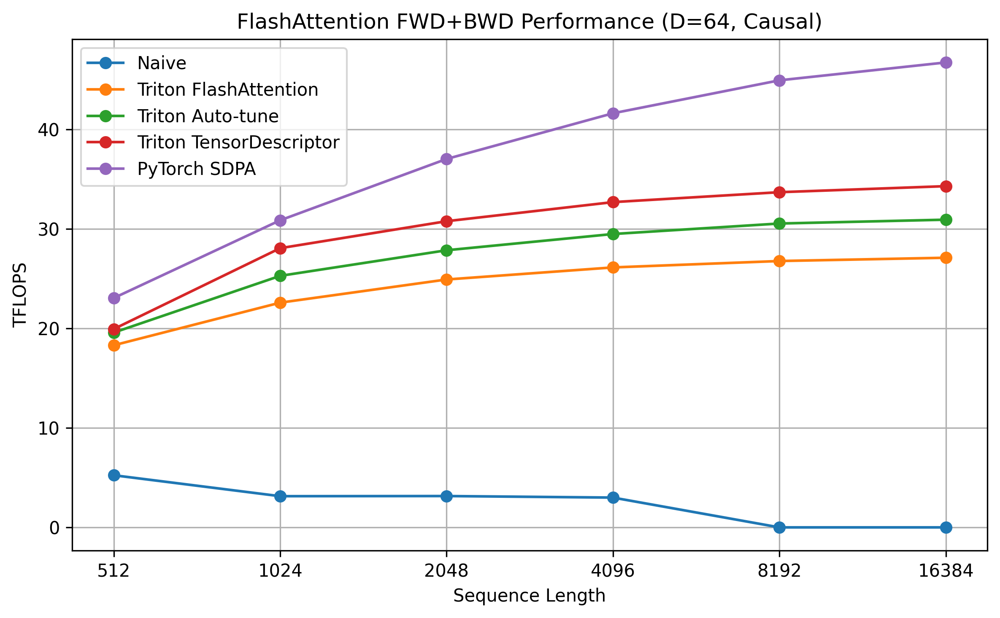
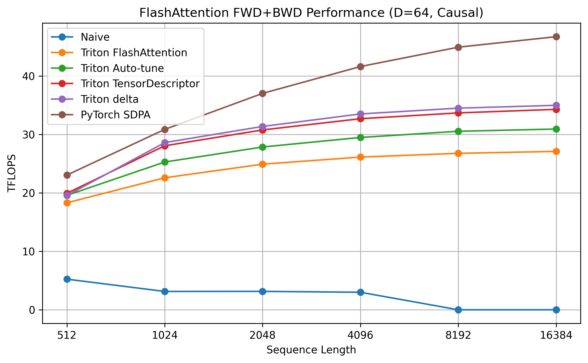
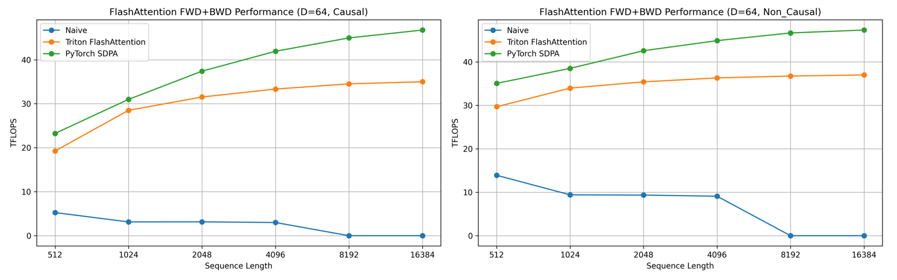
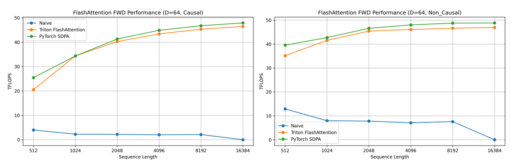
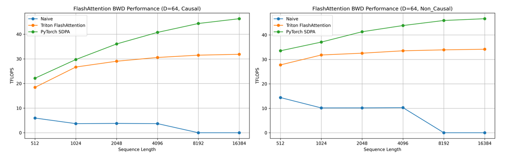
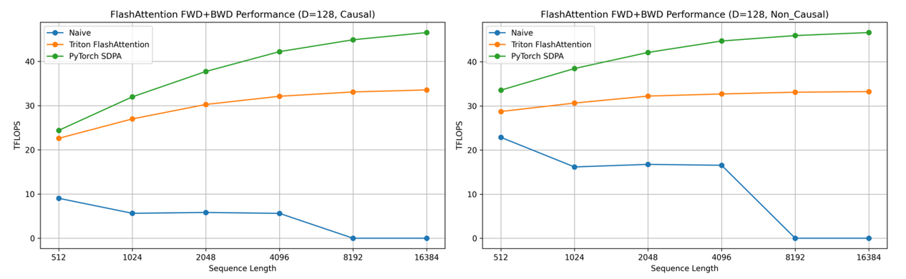
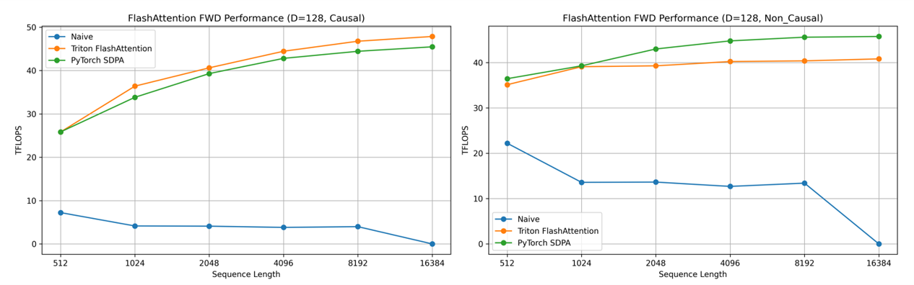
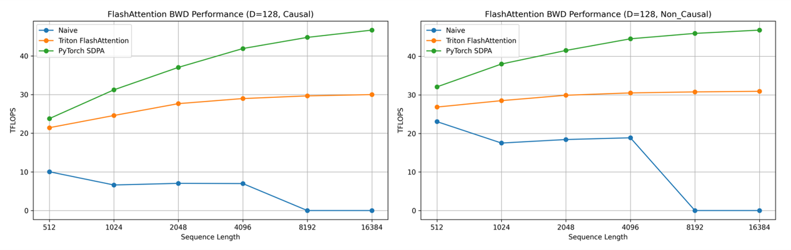

# 从零实现 FlashAttention（Phase 5）：性能调优 —— 从能跑到飞起来

目标：

理解并使用 triton 的核心优化技巧，让我们的算子从“能跑”到“飞起来”，尽可能逼近 Pytorch 官方实现

完整代码请参考：[FlashAttention-from-Scratch-with-Triton/code at main · Pearbiossom-M/FlashAttention-from-Scratch-with-Triton](https://github.com/Pearbiossom-M/FlashAttention-from-Scratch-with-Triton/tree/main/code)

------

## 5.1 建立性能基线

第一步，我们需要测量当前算子的性能作为基线，以验证后续优化是否有效。这里设置：

* `B = 4`，`H = 8`
* 头维度 `D = 64`
* `is_causal=True`
* 计算前向传播 + 反向传播的 **TFLOPS** 作为性能指标

> 为了避免被过多配置淹没，这里选择上述配置作为代表性 workload，以展示每一步的优化收益。当所有优化完成后，我们再对 `D∈{64,128} × is_causal∈{True,False} × mode∈{fwd,bwd,fwd_bwd}` 的完整配置进行统一评测，并在本章末给出总览图

> 这里使用 RTX 5060ti 16G 进行实验，由于GPU内存限制，所有前向+反向（fwd+bwd）基准测试均在头维度 D=64 的条件下进行，但使用的优化策略同样适用于 D=128

TFLOPS 计算方式如下：

```python
# 计算 TFLOPS
# 参考：https://github.com/Dao-AILab/flash-attention/blob/main/benchmarks/benchmark_flash_attention.py
# Forward: 4 * B * H * S_q * S_k * D (2 matmuls: Q@K^T, P@V, each costs 2*S_q*S_k*D FLOPs)
# Backward: 大约是 Forward 的 2.5 倍
flops = 4 * B * H * S_q * S_k * D // (2 if is_causal else 1)
if mode == 'fwd':
    tflops = flops / (avg_time_ms * 1e-3) / 1e12
elif mode == 'bwd':
    tflops = 2.5 * flops / (avg_time_ms * 1e-3) / 1e12  # 2.5x forward
else: # fwd_bwd
    tflops = 3.5 * flops / (avg_time_ms * 1e-3) / 1e12  # 1x forward + 2.5x forward
```

其中 `avg_time_ms` 由如下 `timing` 函数获取，注意：

* GPU kernel 的执行是异步的，使用 CPU 侧的 `time.time()` 往往只能测到 kernel 的 launch 开销，而无法反映真实的执行时间。因此本文采用 `torch.cuda.Event` 在 GPU 执行流中插入时间戳，由 GPU 自身记录起止时间，并在同步后读取两者的间隔，从而获得准确的 GPU 端执行时延。
* 另一方面，首次调用 kernel 时通常会触发编译、自动调优以及缓存冷启动等一次性开销，这些并不属于 steady-state 性能。为避免这类噪声对结果的影响，计时前先执行 warmup，使 GPU 进入稳定运行状态，最终报告的时间为多次重复执行后的平均值。

```python
def timing(run_fn, warmup=10, repeat=30):
    # 1. Warmup：进入 steady state
    for _ in range(warmup):
        run_fn()

    starter = torch.cuda.Event(enable_timing=True)
    ender = torch.cuda.Event(enable_timing=True)
    
	# 2. 确保之前的异步工作完成
    torch.cuda.synchronize()
    
    # 3. 在 GPU stream 中插入起止时间戳
    starter.record()
    for _ in range(repeat):
        run_fn()
    ender.record()
    
    # 4. 等 GPU 执行完成，读取真实耗时
    torch.cuda.synchronize()
    elapsed = starter.elapsed_time(ender)
    
    # 5. 返回单次平均时间 (ms)
    avg_time_ms = elapsed / repeat
    return avg_time_ms
```

这里比较了三种 attention 实现：

* **Naive attention**：纯 Python，标准的 `QKᵀ → softmax → PV` 实现，不进行任何显存优化
* **Triton FlashAttention（本文实现）**：基于 online softmax 的流式计算
* **PyTorch SDPA（官方实现）**：高度优化的工业级实现，作为性能参考上限

结果如下：



* **Naive**：
  
  * 吞吐率随序列长度下降，说明该实现已明显受到显存访存和中间矩阵物化（materialization）的限制
  * 大序列直接不可用（OOM），这正是 FlashAttention 要解决的核心问题
  * **结论**：naive attention 既慢、又不具备可扩展性，只能作为功能正确性的参考。
* **Triton FlashAttention**：

  * **低序列长度**：计算资源利用率不足

    在序列长度较小时，K/V Blocks 数量少，每个 Q Block 经历的**循环次数有限**：

    - 算术强度较低：Q Block 从 HBM 搬入后，仅与少量 K/V Blocks 进行计算
    - **Block 生命周期短**：每个 Block 很快执行完毕
    - **固定开销占比高**：每个 Block 的调度、启动、流水线填充等固定成本在总时间中占比较大

    **SM** 难以长时间维持高效执行状态，计算资源利用率低，此阶段可以理解为“**低算术强度 + 低计算资源利用率**”的区域。

  * **中序列长度**：性能随序列长度增加而增加

    随着序列长度增大，同一个 Q Block 需要与更多的 K/V Blocks 进行计算，内部循环次数增加：

    - 算术强度提升：Q 在片上停留时间变长，每次加载的 Q 在片上被使用更多次
    - 单个 **Block 生命周期变长**： 固定开销被摊薄，计算单元的利用率显著提升

    > 这有一点类似于 **Persistent Block** 的原理

  * **长序列长度**：进入实现平台区

    当序列长度足够大时：

    - block 生命周期已经很长，**调度开销几乎可忽略**
    - 计算资源利用率接近当前实现的上限：再增加序列长度，也只是增加计算时间，尽管算术强度能继续提高，但不会再提升计算资源利用率
    - 这个平台区**并不一定是“硬件理论峰值”**，而只是当前 Triton 实现的性能上限

  * 没有 OOM，具备良好的可扩展性

  * **结论**：Triton FlashAttention 的性能演化本质上是：从“小规模时计算资源未充分利用”过渡到“大规模下计算单元持续高负载运行”。其优势在于显著提高算术强度，以及使算子在大规模下能够充分驱动计算资源，同时保持良好的可扩展性。

  > 平台区表明算子已接近当前实现的上界，而非绝对硬件峰值，因为 PyTorch 官方实现明显性能更好。
  >
  > 进一步提升需要算法层与调度层的协同优化，而不仅仅是增大问题规模。

* **PyTorch SDPA**：
  
  - 整体性能最高，Triton 在平台区约为 PyTorch 的 **55–60%**
  - 该结果验证了测试方法与 FLOPs 估算的合理性
  - **结论**：PyTorch SDPA 提供了一个可信的“工业级参考上限”，用于衡量自定义实现的优化空间。


------

## 5.2 Auto-tune

在之前的内容中，我们主要关注**功能正确性**，不在乎 BLOCK_M 等参数是否会影响性能发挥，所以可以把参数写死。但进入性能调优阶段后，由于 triton 的很多优化手段对 BLOCK_M / BLOCK_N / num_warps / num_stages 比较**敏感**，如果还固定这些参数，当参数不匹配时，很可能导致应用某些优化手段后，性能不升反降。因此为了避免参数不匹配导致的干扰，我们首先进行 auto-tune。

### 5.2.1 kernel 性能受哪些参数影响？

* 每次搬运的 tile 大小（**BLOCK_M / BLOCK_N**）

  * **内存压力**：tile 越大，单次搬运更划算，但 shared/register 压力更大

  * **占用率（occupancy）**：shared/register 压力大，导致活跃 warps 下降，降低占用率

  * **流水线气泡**：占用率降低，流水线更难被填满（出现气泡），延迟难以隐藏，tensor core 打不满

* 线程束数量（**num_warps**）
  * **延迟隐藏**：更多的 warps 意味着硬件有更多的调度选择，更容易隐藏流水线延迟
  * **寄存器压力**：这是关键的负反馈。每个 SM（流式多处理器）的寄存器总量是固定的。`num_warps` 越多，每个线程能分配到的寄存器就越少
    * 如果寄存器不足，编译器会发生 **Register Spilling**（将寄存器溢出到慢速显存），导致性能雪崩
    * 在反向传播（Backward）中，由于需要存更多的中间变量（dQ, dK, dV 等），寄存器压力比前向大得多，因此通常需要比前向更小的 `BLOCK` 或更精细的 `num_warps`
* 流水线阶段数（**num_stages**）
  * 引入 TMA（Tensor Memory Accelerator）后，`num_stages` 定义了在 Shared Memory 中开辟的“缓冲区”数量
  * `num_stages` 越大，流水线越不容易出现气泡，计算单元就越不容易因为等待数据而“饿死”
  * **Shared Memory 限制**：这是硬件限制，如果 `num_stages` 太大，Shared Memory 极易耗尽，导致 kernel 无法启动或 Occupancy 极低，性能雪崩

### 5.2.2 Auto-tune 的实现

FlashAttention 的反向传播**计算更重、寄存器更紧**，因此前向传播和反向传播的最佳参数配置一般不相同，所以我们需要对二者**分别进行 autotune**。

调优配置设置如下：

```python
@triton.autotune(
    configs = [
        triton.Config({'BLOCK_M': 32, 'BLOCK_N': 32}, num_warps=4, num_stages=2),
        triton.Config({'BLOCK_M': 32, 'BLOCK_N': 32}, num_warps=4, num_stages=3),
        triton.Config({'BLOCK_M': 32, 'BLOCK_N': 32}, num_warps=8, num_stages=2),
        triton.Config({'BLOCK_M': 32, 'BLOCK_N': 32}, num_warps=8, num_stages=3),
        triton.Config({'BLOCK_M': 64, 'BLOCK_N': 64}, num_warps=4, num_stages=2),
        triton.Config({'BLOCK_M': 64, 'BLOCK_N': 64}, num_warps=4, num_stages=3),
        triton.Config({'BLOCK_M': 32, 'BLOCK_N': 64}, num_warps=4, num_stages=2),
        triton.Config({'BLOCK_M': 32, 'BLOCK_N': 64}, num_warps=4, num_stages=3),
        triton.Config({'BLOCK_M': 64, 'BLOCK_N': 32}, num_warps=4, num_stages=2),
        triton.Config({'BLOCK_M': 64, 'BLOCK_N': 32}, num_warps=4, num_stages=3),
    ],
    key=['S_q', 'S_k', 'D', 'is_causal'],  # 根据这些参数选择最优配置
)

@triton.jit
def flash_attention_forward_kernel(...)
```

> 注意：`@triton.autotune` 需要与 kernel 放在一起，且一组配置只负责一个kernel，即我们这里的 `flash_attention_forward_kernel`、`flash_attention_dQ_kernel` 和 `flash_attention_dKV_kernel` 都需要单独写一个 `@triton.autotune`。

在使用 `triton.autotune` 时，我们通常把 `grid` 写成一个 `lambda META: ...` 的形式：

- `META` 由 Triton 在每次 autotune 试跑某个 `triton.Config` 时自动传入
- `META` 中会包含该 config 的 tile 参数（如 `BLOCK_M`, `BLOCK_N`），`grid` 就使用当前传入的 tile 参数计算

kernel 启动时，不再手动传入参与 autotune 的几个参数（这里是：`BLOCK_M`, `BLOCK_N`, `num_warps` 和 `num_stages`），这些参数将自动传入。

修改后的 kernel 启动函数如下，以 `flash_attention_forward` 为例，`flash_attention_backward` 同理。

```python
def flash_attention_forward(Q, K, V, is_causal):
    """
    负责分配 O/LSE 并 launch forward kernel
    """
    B, H, S_q, D = Q.shape
    _, _, S_k, _ = K.shape

    device = Q.device
    dtype = Q.dtype
    O = torch.empty((B, H, S_q, D), dtype=dtype, device=device)
    LSE = torch.empty((B, H, S_q), dtype=torch.float32, device=device)

    grid = lambda META: (triton.cdiv(S_q, META['BLOCK_M']), B * H) # BLOCK_M 从 META 字典提取
    flash_attention_forward_kernel[grid](
        Q, K, V, O, LSE,                     
        Q.stride(0), Q.stride(1), Q.stride(2), Q.stride(3),  
        K.stride(0), K.stride(1), K.stride(2), K.stride(3),  
        V.stride(0), V.stride(1), V.stride(2), V.stride(3),  
        O.stride(0), O.stride(1), O.stride(2), O.stride(3), 
        LSE.stride(0), LSE.stride(1), LSE.stride(2),         
        1 / (D ** 0.5), 
        B, H, S_q, S_k, D,
        is_causal=is_causal, # 不手动传入 BLOCK_M, BLOCK_N, num_warps 和 num_stages
    )
    return O, LSE
```

由于该实验是在消费级显卡 RTX 5060ti 上进行的，在 `fwd_bwd` 模式下，未优化的原始实现不支持 `D=128` 的情况，所以上述配置不涉及 `D=128`。当你在支持 `D=128` 的专业 GPU （H200、B200等）上运行时，建议进行以下调整：

* 将自动调优的搜索范围进一步扩大，明确包含 D = 128 这一选项
* 考虑使用更大的 BLOCK_M/N 值，因为此时内存带宽和共享内存容量的限制会相应减轻
* 扩大 `num_warps` 和 `num_stages` 这两个参数的范围，这在专业设备上通常是可行和有益的

总之，在专业设备上的最优配置往往与我这里用消费级 GPU 得到的最优配置不同，即便使用的是相同的 kernel。所以大家要记得按照这些建议，在自己的设备上做一些修改哦！

### 5.2.3 Auto-tune 的结果



* auto-tuning 后的版本相比于原始实现，性能提升在 7% ~ 14% 之间
* 虽然性能瓶颈没有得到根本缓解，但这为我们后续的优化打好了基础，能够避免参数不匹配导致的干扰


------

## 5.3 使用 TensorDescriptor

### 5.3.1 什么是 TensorDescriptor ？

在讲解 TensorDescriptor 之前，我们先回顾一下传统的 triton 数据加载方式：

```python
# 1. 先手动计算每个元素的位置
q_ptrs = (
    Q_ptr
    + batch_idx * stride_qb 
    + head_idx * stride_qh 
    + Sq_offs[:, None] * stride_qs 
    + d_offs[None, :] * stride_qd
) 
# 2. 加载
Q_block = tl.load(q_ptrs, mask=mask_Sq[:, None], other=0.0)
```

这种方式：

* 每个 program 需要显式构造访问地址，通过 `tl.load` 指令从 HBM 加载数据
* 这些地址计算本身虽然并不一定是瓶颈，但会引入额外的指令与寄存器占用，也让编译器难以从整体上识别“这是一次规则的 tile 访问”，从而难以应用更激进的优化。

如何改变这一切呢？这就要用到 NVIDIA 在 **Hopper 架构**（如 H100 / H200 GPU）中引入的一个专用硬件单元：**TMA (Tensor Memory Accelerator)** 了。

TMA 的主要作用有两点：

- 加速**整块 tensor 数据**的传输 —— 从 HBM 到 Shared Memory 的**异步、高效**传输
- 由**硬件根据预先描述好**的 tile 布局完成地址生成与数据搬运，从而减少动态地址计算指令和控制流对计算管线的干扰

而截至目前在 triton 这一层，暴露给用户、能稳定表达并触发 TMA 的接口就是 `TensorDescriptor`，普通的 `tl.load` / `tl.make_block_ptr` 仍然属于以“指针 + 访问”为核心的访存模型，虽然编译器可能进行一定优化，但**并不等价于“保证走 TMA”**。

> TMA 要求搬运的是规则二维/多维 tile，并且希望形状、步幅、边界处理（padding/越界）在编译期尽可能明确；
>
> `TensorDescriptor` 把这些信息固定下来，降低了动态地址计算与控制流，从而让后端能合法、安全地使用 TMA。

### 5.3.2 如何使用 TensorDescriptor ？

首先在 python 层定义，按照顺序传入：矩阵本身，矩阵的形状，每个维度的 `stride`，搬运的每块数据的形状和越界访问的填充值。

然后，将定义好的 desc_q 传入 kernel。kernel 内部加载时传入数据块的起点即可。

```python
# 参考：https://github.com/triton-lang/triton/blob/main/python/triton/tools/tensor_descriptor.py
from triton.tools.tensor_descriptor import TensorDescriptor

# 1. python 层直接定义
desc_q = TensorDescriptor(
    Q, shape=[B*H*S_q, D], strides=[D, 1], block_shape=[BLOCK_M, D], padding="zero"
)
# 2. 传入 kernel, kernel 内加载只需传入数据块的起点即可
@triton.jit
def flash_attention_forward_kernel(desc_q, ...):
    ...
    # load Q block
    qo_offsets_y = batch_idx * H * S_q + head_idx * S_q + pid_0 * BLOCK_M
    Q_block = desc_q.load([qo_offsets_y, 0])
    ...
```

这里使用了一个小技巧：将 `[B, H, S_q, D]` 这个 4D 张量展平成 2D。如果不这样，而是使用 4D 进行定义，那就变成了：

```python
desc_q = TensorDescriptor(
    Q, shape=[B, H, S_q, D], strides=[H*S_q*D, S_q*D, D, 1], block_shape=[1, 1, BLOCK_M, D], padding="zero"
)
```

不仅索引计算变复杂，而且 block 形状被迫变成 `[1,1,BLOCK_M,D]`，使用时还要先 `squeeze` 掉前两个维度。

> `TensorDescriptor` 源码里有硬约束：
>
> - `rank = len(shape)`
> - `len(strides) == rank`
> - `len(block_shape) == rank`
> - `strides[-1] == 1` (Last dimension must be contiguous)

总之，4D 描述会引入两维“空维度”，让 **block/索引/形状处理**都更繁琐，而 **2D 展平**能直接把要用的块表达成 `[BLOCK_M, D]`。建议大家记住并使用这个小技巧！

### 5.3.3 代码实现

以 `flash_attention_forward` 为例，`flash_attention_backward` 同理。

```python
import triton
import triton.language as tl

# ==============================================================================
# Forward Pass
# ==============================================================================
def _host_descriptor_pre_hook_fwd(nargs):
    BLOCK_M = nargs["BLOCK_M"]
    BLOCK_N = nargs["BLOCK_N"]
    D = nargs["D"]

    nargs["desc_q"].block_shape = [BLOCK_M, D]
    nargs["desc_o"].block_shape = [BLOCK_M, D]
    nargs["desc_lse"].block_shape = [BLOCK_M]
    nargs["desc_k"].block_shape = [BLOCK_N, D]
    nargs["desc_v"].block_shape = [BLOCK_N, D]
    
@triton.autotune(
    configs = [
        triton.Config({'BLOCK_M': 32, 'BLOCK_N': 32}, num_warps=4, num_stages=2, pre_hook=_host_descriptor_pre_hook_fwd),
        triton.Config({'BLOCK_M': 32, 'BLOCK_N': 32}, num_warps=4, num_stages=3, pre_hook=_host_descriptor_pre_hook_fwd),
        triton.Config({'BLOCK_M': 32, 'BLOCK_N': 32}, num_warps=8, num_stages=2, pre_hook=_host_descriptor_pre_hook_fwd),
        triton.Config({'BLOCK_M': 32, 'BLOCK_N': 32}, num_warps=8, num_stages=3, pre_hook=_host_descriptor_pre_hook_fwd),
        triton.Config({'BLOCK_M': 64, 'BLOCK_N': 64}, num_warps=4, num_stages=2, pre_hook=_host_descriptor_pre_hook_fwd),
        triton.Config({'BLOCK_M': 64, 'BLOCK_N': 64}, num_warps=4, num_stages=3, pre_hook=_host_descriptor_pre_hook_fwd),
        triton.Config({'BLOCK_M': 32, 'BLOCK_N': 64}, num_warps=4, num_stages=2, pre_hook=_host_descriptor_pre_hook_fwd),
        triton.Config({'BLOCK_M': 32, 'BLOCK_N': 64}, num_warps=4, num_stages=3, pre_hook=_host_descriptor_pre_hook_fwd),
        triton.Config({'BLOCK_M': 64, 'BLOCK_N': 32}, num_warps=4, num_stages=2, pre_hook=_host_descriptor_pre_hook_fwd),
        triton.Config({'BLOCK_M': 64, 'BLOCK_N': 32}, num_warps=4, num_stages=3, pre_hook=_host_descriptor_pre_hook_fwd),
    ],
    key=['S_q', 'S_k', 'D', 'is_causal'],  # 根据这些参数选择最优配置
)

@triton.jit
def flash_attention_forward_kernel(
    # ----------------- TensorDescriptor ---------------
    desc_q, desc_k, desc_v, desc_o, desc_lse,

    # -------------------- 缩放因子 --------------------
    scale, # 1 / sqrt(D)

    # -------------------- 维度信息 --------------------
    # Q: [B, H, S_q, D],  K/V: [B, H, S_k, D],  O: [B, H, S_q, D]
    B: tl.constexpr,       # batch size
    H: tl.constexpr,       # 注意力头数
    S_q: tl.constexpr,     # 序列长度 (Q 和 O 的行数)
    S_k: tl.constexpr,     # 序列长度 (K/V 的行数)
    D: tl.constexpr,       # head_dim

    # -------------------- 配置参数 ---------------------
    BLOCK_M: tl.constexpr, # Q_block 的行数
    BLOCK_N: tl.constexpr, # 流式扫描 K/V 的列块大小 (沿 N 维)
    
    # -------------------- Flag参数 --------------------
    is_causal: tl.constexpr = False,
):
    """
    FlashAttention forward kernel
    """
    pid_0 = tl.program_id(0) 
    pid_1 = tl.program_id(1)
    batch_idx = pid_1 // H
    head_idx = pid_1 % H

    Sq_offs = pid_0 * BLOCK_M + tl.arange(0, BLOCK_M)  # [BLOCK_M,]

    # mask：处理最后一个 Q_block, 因为可能越界, 用于 score 
    # mask_Sq = Sq_offs < S_q
    
    # load Q block
    qo_offsets_y = batch_idx * H * S_q + head_idx * S_q + pid_0 * BLOCK_M
    Q_block = desc_q.load([qo_offsets_y, 0])

    # 初始化统计量
    m = tl.full([BLOCK_M], float('-inf'), tl.float32)
    l = tl.zeros([BLOCK_M], tl.float32)
    o = tl.zeros([BLOCK_M, D], tl.float32)

    LOG2_E = 1.44269504 # log2(e), 用于tl.exp 到 tl.exp2 的转化

    # 逐块处理 K/V block
    loop_end = (pid_0 + 1) * BLOCK_M if is_causal else S_k # causal 模式可以提前截断循环
    for start_s in range(0, loop_end, BLOCK_N):
        # load K/V block
        kv_offsets_y = batch_idx * H * S_k + head_idx * S_k + start_s
        K_block = desc_k.load([kv_offsets_y, 0]) # [BLOCK_N, D]
        V_block = desc_v.load([kv_offsets_y, 0]) # [BLOCK_N, D]

        Sk_offs = start_s + tl.arange(0, BLOCK_N)
        mask_Sk = Sk_offs < S_k
    
        # 计算 score, [BLOCK_M, D] @ [D, BLOCK_N] -> [BLOCK_M, BLOCK_N]
        S_block = tl.dot(Q_block, tl.trans(K_block)) * scale  # [BLOCK_M, BLOCK_N]
        S_block = tl.where(mask_Sk[None, :], S_block, float('-inf')) # [BLOCK_M, BLOCK_N]

        # 当前 block 全部能被看见的判定条件：Q block的最小索引 >= K block的最大索引
        # 需要 causal mask 的判定条件：        
        if is_causal:
            q_idx_min = pid_0 * BLOCK_M
            k_idx_max = start_s + BLOCK_N - 1
            if not (q_idx_min >= k_idx_max):
                causal_mask = Sq_offs[:, None] >= Sk_offs[None, :] # [BLOCK_M, BLOCK_N]
                S_block = tl.where(causal_mask, S_block, float('-inf')) # [BLOCK_M, BLOCK_N]

        # 更新统计量
        m_new = tl.maximum(m, tl.max(S_block, axis=1)) # [BLOCK_M,]

        correction = tl.exp2((m - m_new) * LOG2_E) # [BLOCK_M,]
        numerator = tl.exp2((S_block - m_new[:, None]) * LOG2_E) # [BLOCK_M, BLOCK_N]

        l = l * correction + tl.sum(numerator, axis=1) # [BLOCK_M,]
        # Tensor Core 的矩阵乘法要求输入为半精度(或 TF32)
        # 因此这里将 numerator 转回 fp16, 使 tl.dot 有机会使用 Tensor Core
        # 而累加仍然在 fp32 的 o 中完成, 以保证数值稳定性
        o = o * correction[:, None] + tl.dot(numerator.to(tl.float16), V_block) # [BLOCK_M, D]

        m = m_new
    
    # 最终归一化
    o_final = o / l[:, None] 

    # write back to O_ptr
    desc_o.store([qo_offsets_y, 0], o_final) # [BLOCK_M, D]

    # 计算 LogSumExp
    lse = m + tl.log(l) # [BLOCK_M,]
    
    # write back to L_ptr
    desc_lse.store([qo_offsets_y], lse)
```

大家有没有发现，使用 `TensorDescriptor` 时，除了把原本的“指针+访存”的数据加载模式修改为使用 `desc_q.load()` 和 `desc_o.store()` 之外，还增加了一个 pre hook 函数（`_host_descriptor_pre_hook_fwd`）？

讲解这个函数之前，我们先来看看 `flash_attention_forward_kernel` 修改后的启动函数：

```python
from triton.tools.tensor_descriptor import TensorDescriptor

def flash_attention_forward(Q, K, V, is_causal):
    """
    负责分配 O/LSE 并 launch forward kernel
    """
    B, H, S_q, D = Q.shape
    _, _, S_k, _ = K.shape

    device = Q.device
    dtype = Q.dtype
    O = torch.empty((B, H, S_q, D), dtype=dtype, device=device)#.contiguous()
    LSE = torch.empty((B, H, S_q), dtype=torch.float32, device=device)#.contiguous()

    # 由于block_shape需要使用 BLOCK_M 等参数，而这些参数在带 autotune 的 kernel 调用后才能获取
    # TensorDescriptor 是先创建的, BLOCK_M 是后选的,那 descriptor 的 block_shape 写什么
    # 先写一个 dummy block_shape，然后用 pre_hook 在 launch 前补上“真实值”
    dummy_block_2D = [1, 1] 
    dummy_block_1D = [1] 

    # 创建 TensorDescriptor
    desc_q = TensorDescriptor(
        Q,
        shape=[B*H*S_q, D], # 展平成 2D, 后续 desc.load([y,0]) → 直接得到 [BLOCK_M,D], 比使用 4D 更优
        strides=[D, 1],     # 注意：stride[-1] 必须是 1
        block_shape=dummy_block_2D, # 先用 dummy_block 占位, 把 TensorDescriptor 建起来
        padding="zero",
    )
    desc_k = TensorDescriptor(
        K, shape=[B*H*S_k, D], strides=[D, 1], block_shape=dummy_block_2D, padding="zero",
    )
    desc_v = TensorDescriptor(
        V, shape=[B*H*S_k, D], strides=[D, 1], block_shape=dummy_block_2D, padding="zero",
    )
    desc_o = TensorDescriptor(
        O, shape=[B*H*S_q, D], strides=[D, 1], block_shape=dummy_block_2D, padding="zero",
    )
    desc_lse = TensorDescriptor(
        LSE, shape=[B*H*S_q], strides=[1], block_shape=dummy_block_1D, padding="zero",
    )

    grid = lambda META: (triton.cdiv(S_q, META['BLOCK_M']), B * H)
    flash_attention_forward_kernel[grid](
        desc_q, desc_k, desc_v, desc_o, desc_lse,                              
        1 / (D ** 0.5), 
        B, H, S_q, S_k, D,
        is_causal=is_causal,
    )
    return O, LSE
```

启动函数也变啦！最大的变化在于，需要在 host 端先创建并传入 `TensorDescriptor`。但 `TensorDescriptor` 的 `block_shape` 通常依赖 autotune 选出的 tile 参数（如 `BLOCK_M/BLOCK_N`）。因此我们会先用一个占位的 `block_shape` 创建 descriptor，然后利用 `pre_hook` 在 **本次 launch 之前**、且已经确定了本次 config 的前提下，把 `block_shape` 写成真实值。

> 注意：`pre_hook(nargs)` 的 `nargs` 里能拿到哪些字段取决于在 host 端调用 kernel 时传进去的 **所有 runtime 参数**以及本次 autotune 选中的 **meta 参数**

### 5.3.4 实验结果



* 相比于单纯使用 autotune，增加 `TensorDescriptor` 后，性能提升 10% 左右


------

## 5.4 计算流程优化

我们回忆一下反向传播的两个 kernel：`flash_attention_dQ_kernel` 和 `flash_attention_dKV_kernel`

* 二者都需要使用 `delta` 矩阵

  ```python
  delta_block = tl.sum(dO_block.to(tl.float32) * O_block.to(tl.float32), axis=-1)
  ```

* 且二者都计算了 `dalta`，尤其是 `flash_attention_dKV_kernel` 中，`delta` 的计算位于循环中，需要多次计算

这个计算流程有没有可以进一步优化的可能呢？给大家一个小提示：**两个 kernel 能不能只算一次 `delta` ？**

### 5.4.1 优化方法

反向传播 kernel 的执行顺序是 `flash_attention_dQ_kernel → flash_attention_dKV_kernel`，可以保存 dQ_kernel 计算的 `delta` 矩阵，在执行 dKV_kernel 时，直接传入 `delta`。

此方法还带来一个隐藏优化：由于 dKV_kernel 不再需要重新计算 `delta`，所以就不用加载 `O` 矩阵了，进一步降低了寄存器压力。

### 5.4.2 代码实现

首先，修改 `flash_attention_dQ_kernel`，只需增加保存 `delta` 的功能即可：

```python
def _host_descriptor_pre_hook_bwd_dQ(nargs):
    BLOCK_M = nargs["BLOCK_M"]
    BLOCK_N = nargs["BLOCK_N"]
    D = nargs["D"]
	...
    nargs["desc_delta"].block_shape = [BLOCK_M] # pre hook 函数增加 desc_delta 项
    
def flash_attention_dQ_kernel(
    # ----------------- TensorDescriptor ---------------
    ..., desc_delta, # 输入参数增加一个 delta 的 TensorDescriptor 实例
	...
):
    ...
    # save delta
    desc_delta.store([qo_offsets_y], delta_block) # 增加 delta 保存操作
```

再修改 `flash_attention_dKV_kernel`：

```python
def _host_descriptor_pre_hook_bwd_dKV(nargs):
    BLOCK_M = nargs["BLOCK_M"]
    BLOCK_N = nargs["BLOCK_N"]
    D = nargs["D"]
    ...
    nargs["desc_delta"].block_shape = [BLOCK_M] # pre hook 函数增加 desc_delta 项
    
def flash_attention_dKV_kernel(
    # ----------------- TensorDescriptor ---------------
    desc_q, desc_k, desc_v, desc_do, desc_lse, desc_dk, desc_dv, desc_delta, # 增加 desc_delta, 删除 desc_o
	...
):
    ...
    # 6. 从 dQ kernel 保存的 delta 直接加载
    delta_block = desc_delta.load([qo_offsets_y])  # 从原来的重新计算修改为直接加载, 同时去掉原本 O_block的加载
    ...
```

最后修改 kernel 启动函数：

```python
def flash_attention_backward(Q, K, V, O, dO, LSE, is_causal):
    ...
    delta = torch.empty((B, H, S_q), dtype=torch.float32, device=device) # 创建一个中间变量

    # 创建 TensorDescriptor
    dummy_block_1D = [1] 
    ...
    desc_delta = TensorDescriptor(
        delta, shape=[B*H*S_q], strides=[1], block_shape=dummy_block_1D, padding="zero"
    )

    # 计算 dQ
    grid_Q = lambda META: (triton.cdiv(S_q, META['BLOCK_M']), B * H)
    flash_attention_dQ_kernel[grid_Q](
        desc_q, desc_k, desc_v, desc_do, desc_o, desc_lse, desc_dq, desc_delta, # 增加 desc_delta
        1 / (D ** 0.5),
        B, H, S_q, S_k, D,
        is_causal=is_causal,
    )

    # 计算 dK/V
    grid_KV = lambda META: (triton.cdiv(S_k, META['BLOCK_N']), B * H)
    flash_attention_dKV_kernel[grid_KV](
        desc_q, desc_k, desc_v, desc_do, desc_lse, desc_dk, desc_dv, desc_delta, # 增加 desc_delta, 删除 desc_o
        1 / (D ** 0.5),
        B, H, S_q, S_k, D,
        is_causal=is_causal, 
    )

    return dQ, dK, dV
```

### 5.4.3 实验结果



* 在使用 TensorDescriptor 的基础上性能小幅度提升

------

## 5.5 看似可行的优化手段

接下来展示两种看起来可行，但是实际上没用的优化方法。

### 5.5.1 内存布局“优化” —— 预转置 K 矩阵

大家应该注意到了，无论是前向还是反向传播，都会涉及到计算 score 矩阵：

```python
S_block = tl.dot(Q_block, tl.trans(K_block)) * scale
```

这句代码中，涉及到了对 **K 矩阵的转置**，而转置是有开销的，再加上计算 score 矩阵通常出现在循环内，每个 program 需要处理很多次转置，这就进一步放大了转置开销。这时，大家可能会想到：能不能在传入 kernel 前就将 K 矩阵预先转置呢？这样岂不是节约一大笔转置开销！能想到这一点，大家已经很棒啦👍👍

但是，这个想法真的正确吗？这就要涉及到**在 kernel 外转置**和**运行时在寄存器中转置**的开销对比了。如果我们选择在 kernel 外进行转置，就需要在**显存**中进行矩阵的读写，相比于在寄存器中进行操作，前者太慢了。所以，**预转置 K 矩阵**这个方法，实际上不可行！

大家可以自行验证一下，你会发现预转置后性能不升反降。

### 5.5.2 Warp Specialization

#### Warp Specialization 是什么 ？

>  `Warp Specialization` 的核心思想是：**让同一个 thread block 里的不同 warp，长期固定地做不同的事情，而不是所有 warp 轮流做所有事情。**

在传统 CUDA / Triton kernel 里，一个 block 内的 warp 往往是**“同构的”**（我们这里也是）：

- 每个 warp 都执行同样的指令流
- 只是处理不同的数据 tile

`Warp specialization` 则是**“异构分工”**。在 FlashAttention 这样的算子中，`Warp Specialization` 通常用于：

- 一部分 warp 持续搬运 K/V 或统计量
- 另一部分 warp 专注于矩阵计算和输出累加

> 但这类优化高度依赖底层硬件调度和编译器支持，在本教程中，我们只理解其思想，而不强求完全复现。

#### 如何在 triton 中使用 ？

截至目前，主要通过在 `triton.language.range` 中设置 `warp_specialize` 参数来控制是否使用 `Warp Specialization`，例如：

```python
for start_s in tl.range(0, loop_end, BLOCK_N, warp_specialize=True):
    ...
```

具体可以参考官方文档：https://triton-lang.org/main/python-api/generated/triton.language.range.html

但是也要注意，官方文档明确表示：

```markdown
Note that warp specialization is only supported on Blackwell GPUs and only works on simple matmul loops. Support for arbitrary loops will be expanded over time.
```

也就是说有两点限制：

* 必须是 Blackwell 架构 GPU（如：B200 GPU 等）
* 目前只能用于简单的矩阵运算

#### FlashAttention 可以使用吗？

这是大家最关心的问题，但是很遗憾，至少目前还用不了。FlashAttention 尤其是 backward，涉及到矩阵乘、流式累加、指数运算等，已经触及了 Triton 当前 `Warp Specialization` 的硬限制。大家可以自行尝试验证。

经过我的实验，如果强行开启 `Warp Specialization`，反向传播会造成 dQ 和 dK 两个矩阵计算错误，而前向传播即使计算正确，性能也有所下降。不过我相信随着 triton 进一步发展，这个功能总会有能用到 FlashAttention 的一天，大家可以先记住 Warp Specialization 这个优化手段。

------

## 5.6 全面性能验证

到这里，我们的 FlashAttention 算子优化就结束了，接下来，让我们全面的验证一下在不同头维度 `D`、不同模式、不同序列长度以及是否开启 `is_causal` 场景下的算子性能，同时对比 **Naive attention** 和 **PyTorch SDPA**。

### 5.6.1 D = 64，mode = 'fwd_bwd'，is_causal = True / False



### 5.6.2 D = 64，mode = 'fwd'，is_causal = True / False



### 5.6.3 D = 64，mode = 'bwd'，is_causal = True / False



### 5.6.4 D = 128，mode = 'fwd_bwd'，is_causal = True / False

在性能调优前，由于GPU内存限制，前向+反向（fwd+bwd）的测试均只能在头维度 D=64 的条件下进行，但是优化后，已经可以在 D=128 的情况下运行。这说明优化不仅仅提升了性能，还提升了算子的可扩展性！



### 5.6.5 D = 128，mode = 'fwd'，is_causal = True / False



### 5.6.6 D = 128，mode = 'bwd'，is_causal = True / False



------

## 5.7 性能调优复盘

* **为什么 Backward 比 Forward 慢？**

  Backward 的性能低于 Forward 并非实现问题，而是算法结构使然。相比 Forward 主要由规则的矩阵乘和 online softmax 构成，Backward 需要重建 softmax 概率、额外的 reduce（如 `delta`），并包含更多阶段性的计算与依赖。这些操作难以组织成单一高效的 GEMM 主干，因此其可达到的算术强度和并行度天然低于 Forward，这一现象在官方实现中同样存在。

* **为什么 Triton 很难完全复现官方 Backward？**

  官方 FlashAttention Backward 的性能优势，主要来自 **persistent thread blocks、warp specialization 等架构级调度优化**，而非算法本身。这些优化依赖对线程生命周期和 SM 常驻状态的精细控制，超出了 Triton 作为 kernel-level DSL 的设计边界。因此，Triton 实现可以逼近其算法效率，但难以在调度层面完全复现官方实现的极限性能。

* **为什么说当前性能已经“足够好”？**

  从测试结果来看，本实现的性能曲线随序列长度增长稳定提升并趋于饱和，表明 kernel 已进入计算受限区间。在 Forward 场景下，性能已接近甚至局部追平 PyTorch 官方实现；在 Backward 及 fwd+bwd 场景中，稳定达到其 70%～80%。在 Triton 可表达的优化空间内，这一结果已接近可实现的上限。

* **如果要更进一步，Triton 场景下是否可行？**

  在 Triton 框架内，仍可通过更激进的 kernel fusion、配置搜索或减少中间结果重建获得有限提升，但依赖 persistent blocks、warp 级角色分工或跨 kernel 常驻状态的优化并不具备可行性。换言之，进一步的大幅提升需要进入 CUDA/PTX 层级，不再是 Triton 的目标使用场景。

> 在 Triton 的能力边界内，该实现已在可读性、可维护性与性能之间取得了接近最优的平衡。

------

## 5.8 本章小结

本章从“先测清楚再优化”的原则出发，先建立了可复现的性能基线：用 GPU 事件计时、剔除冷启动开销，并以 TFLOPS 统一衡量不同实现的吞吐。基线对比清晰地展示了：naive attention 既慢又不可扩展，而基于 online softmax 的流式计算能避免中间矩阵物化，使算子在长序列下保持稳定扩展，并逐步进入 compute-bound 区间。

在优化路径上，我们依次引入了三类关键手段：

* **Auto-tune** 解耦性能与手工参数选择，避免 BLOCK/warp/stage 不匹配带来的“优化失真”
* **TensorDescriptor + pre_hook** 让 tile 访存表达更规则，为后端触发更高效的数据搬运（如 TMA）创造条件
* **计算流程重排**（复用并缓存 `delta`）减少冗余计算与不必要的张量加载，进一步缓解反向传播的寄存器与带宽压力。

与此同时，本章也刻意展示了两类“看似合理但无效”的思路：预转置 K 受限于显存读写成本，而 warp specialization 目前受硬件与 Triton 支持范围限制，尚难直接用于完整 FlashAttention（尤其 backward）。

最后的全面评测表明：

* 优化后的实现具备良好的可扩展性与稳定性 —— Forward 场景下性能已接近（部分配置下可追平）PyTorch SDPA
* Backward 及 fwd+bwd 场景中稳定达到其 70%～80% 区间。

综合来看，在 Triton 的表达边界内，我们已经在**性能、可维护性与可讲解性**之间取得了接近最优的平衡！


